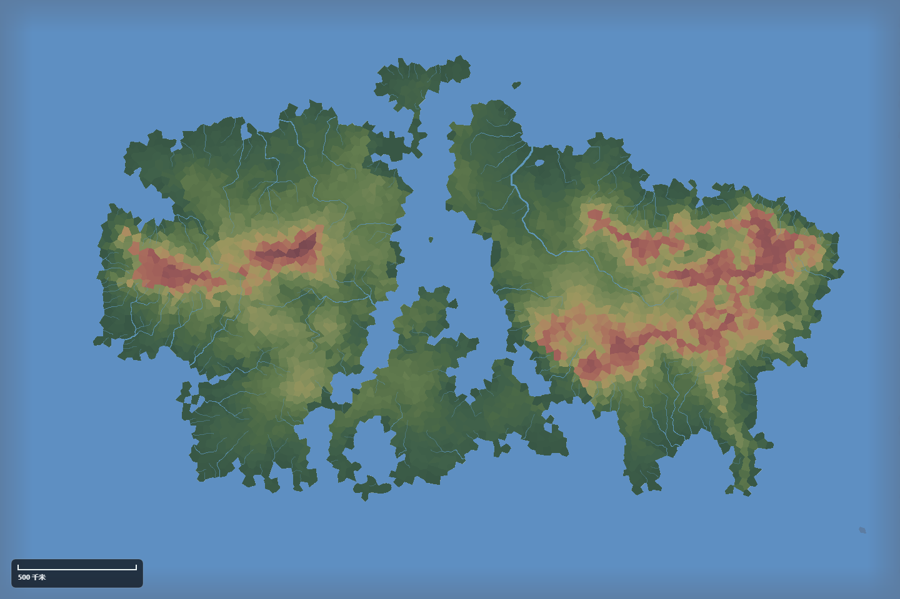
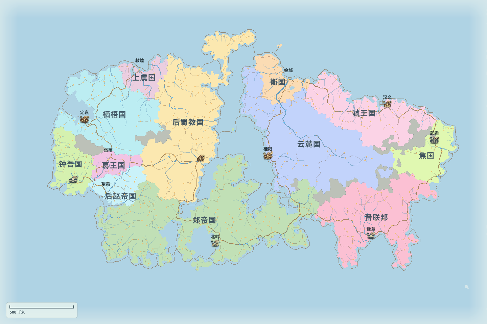

[简体中文](./README.md) | [English](./README.en.md)

# WebGL Fantasy Map Generator

WebGL Fantasy Map Generator is made for worldbuilding, tabletop RPGs, alternate-history writing, and anyone who simply enjoys maps. It takes inspiration from how [Fantasy Map Generator](https://github.com/Azgaar/Fantasy-Map-Generator) generates and presents a world, as well as its visual style. The application itself was built from scratch, independently of the original project. You can generate a complete map in a few steps, then inspect, revise, and keep developing the world it describes.

[Try it online](https://fmg.mosuzi.top/) · [Chinese Wiki](https://github.com/mosuzi/WebGL-Fantasy-Map-Generator/wiki) · [Development story (Chinese)](https://mosuzi.com/docs/webgl-fantasy-map-generator-development/) · [Quick start](#quick-start) · [Documentation](#documentation-guide)

| Natural relief | State view |
|---|---|
|  |  |

## From landscape to society

Each map starts with its natural setting. Land and sea establish the outline; climate, water, and terrain shape one another; rivers cross uplands and plains; and biomes follow temperature and rainfall. There is no need to specify every detail in advance. Once the map is generated, thematic views show how these elements combine to shape it.

Human geography comes next. Settlements appear in habitable areas and roads connect them. States, provinces, cultures, and religions take form across the landscape, while economy, trade, diplomacy, and military affairs provide the social context. These parts remain connected, so they can be compared and adjusted on the same map.

For a complete introduction, see the [Features and domains overview (Chinese)](./docs/wiki/功能与领域总览.md).

## Inspect, edit, and save

After generation, you can move between the map and its management views, inspect thematic information, select and locate places or objects, and adjust a specific area when needed. Edits have defined scopes. Common changes enter the undo and redo history; operations that may affect other content show their impact and confirmation requirements first, and explicit locks protect important objects.

Save the complete map whenever you want to pause or preserve a version, then continue editing it later. You can also export images, geographic data, and other purpose-specific results. Older maps have versioned migration and compatibility paths, but not every historical file is guaranteed to convert without loss. Keep the original of any important map and save the migrated version separately. See [Editing and safe changes (Chinese)](./docs/wiki/编辑器与安全修改.md), [Saves, imports, and exports (Chinese)](./docs/wiki/存档与导入导出.md), and [Older-map compatibility (Chinese)](./docs/wiki/旧图兼容.md) for details.

## API and automation

The project provides several supported entry points for scripts and AI-assisted work. In an open page, `window.webglGeneratorApi` can read the map, find objects, run analysis, and invoke controlled edits. For local save files, the headless read-only interface runs batch queries and regional analysis without opening a browser. When a file must be changed, the separate headless writing interface exposes only constrained actions and writes a new file by default, leaving the source map intact.

Before an AI tool can work with the current tab, the user must explicitly enable the controlled bridge from the page. The bridge starts read-only and keeps its authorization state visible. High-impact changes still require inspection, explicit confirmation, version checks, and transactional rollback. It neither runs arbitrary scripts nor bypasses the map's editing rules.

This README only outlines what each entry point is for. For exact methods, inputs, and safety boundaries, see [API and automation (Chinese)](./docs/wiki/API与自动化.md). To hand a map to an AI client, begin with the [AI handoff guide (Chinese)](./docs/ai/README.md).

## Development story

The Chinese article [*Building a WebGL fantasy map generator from scratch with AI*](https://mosuzi.com/docs/webgl-fantasy-map-generator-development/) traces the project from its SVG performance baseline and WebGL2 prototype through the independent generator, older-map compatibility, controlled AI APIs, browser acceptance, coastline topology, performance work, and the desktop-packaging experiment.

## Quick start

Local development requires Node.js `^20.19.0` or `>=22.12.0`, pnpm 10, and a modern browser with WebGL2 support.

```powershell
pnpm install
pnpm run dev
```

The development server runs at <http://127.0.0.1:5410> by default. To create a production build, run:

```powershell
pnpm run build
```

See the [installation and first-run guide (Chinese)](./docs/wiki/安装与快速开始.md) for the full instructions. To skip local installation, open the [online version](https://fmg.mosuzi.top/).

## Documentation guide

| Task | Guide |
|---|---|
| Install the project and generate a first map | [Installation and quick start (Chinese)](./docs/wiki/安装与快速开始.md) |
| Understand the natural, human, and expressive layers | [Features and domains overview (Chinese)](./docs/wiki/功能与领域总览.md) |
| Select, edit, and protect map objects | [Editing and safe changes (Chinese)](./docs/wiki/编辑器与安全修改.md) |
| Save a map or choose an export format | [Saves, imports, and exports (Chinese)](./docs/wiki/存档与导入导出.md) |
| Use scripts, headless workflows, or the current-tab bridge | [API and automation (Chinese)](./docs/wiki/API与自动化.md) |
| Open an older map and understand migration limits | [Older-map compatibility (Chinese)](./docs/wiki/旧图兼容.md) |
| Let an AI analyze or safely modify a map | [AI handoff guide (Chinese)](./docs/ai/README.md) |
| Inspect or maintain an independent lab / prototype | [Laboratory and prototype guide (Chinese)](./docs/architecture/laboratory-prototypes.md) |
| See the only authoritative scope of current work | [Authoritative task list (Chinese)](./docs/current-plan.md#权威任务清单) |
| Trace major decisions and acceptance results | [Development log (Chinese)](./docs/development-log.md) |

All of these links point to documentation sources maintained in this repository. A reader-facing version is also published to the [project's GitHub Wiki](https://github.com/mosuzi/WebGL-Fantasy-Map-Generator/wiki), while `docs/wiki/` remains the only traceable, auditable, and reproducible source.

## Project status and scope

The main application is past its early placeholder prototype, but it remains under active development and has not been released as a stable product. Features, interface details, and save conventions may still change. The [authoritative task list (Chinese)](./docs/current-plan.md#权威任务清单) is the only source of active project scope; ideas in this README or the topic guides do not become tasks automatically.

`source/Fantasy-Map-Generator` is kept solely as a reference for the original project's behavior and presentation. This is an independent project, not a modified copy or official successor, and the reference source remains unchanged.

## Credits and license

The project is authored by mosuzi. All application code was produced with Codex and GPT, and the documentation was written with Codex and GPT as well.

Thanks to Max Haniyeu (Azgaar) and the community behind [Fantasy Map Generator](https://github.com/Azgaar/Fantasy-Map-Generator). Much of this project's thinking about generation and visual presentation builds on their work. Copyright and licensing for the original project remain as stated in its repository.

This project is available under the [MIT License](./LICENSE).
