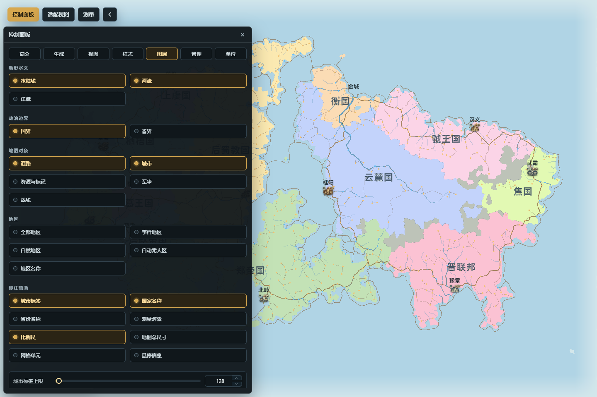

# 专题图层与视觉样式

专题、视觉主题、图层、标签样式和显示单位共同决定“怎样看这张地图”。除明确的主题 / 标签文档编辑外，它们不会改变国家归属、城市位置、河道、高度等地图事实。

*图：国家专题视图下，图层页可独立控制水文、边界、对象、地区和标注。*

## 视图：专题与视觉主题

**入口**：`控制面板 → 视图`。

**用途**：专题决定单元格按哪个字段着色，视觉主题决定基础配色和线条风格。两者相互独立。

可用专题包括：

- 高度、温度、降水、生物群系；
- 文化、宗教、外交、政体；
- 国家、省份、区域、人口。

**关键操作**：

- 在专题分段按钮中选择观察维度。例如“高度”用于看地貌，“外交”用于看当前主体的关系，“国家”用于看政治版图。
- 在“视觉主题”中选择内置主题。需要自定义时，可把当前主题复制为用户主题，再编辑陆地、水域、国界、省界、道路、主要标签和比例尺颜色。
- 用户主题可以导入和导出；内置主题应先复制后编辑。
- 高度专题可选择是否显示海底；“平滑边界”只改变单元边缘的视觉过渡，不修改拓扑或存档几何。

**结果与持久化**：切换专题和主题会立即重绘地图，但地图 revision 与对象数据不应因此改变。显示偏好可在当前浏览器中保留；用户主题作为独立主题文档管理。

**常见误区**：视觉主题不是专题。选择 atlas 一类主题不会自动切到国家专题，选择国家专题也不会自动打开城市、国界或国家名称图层。

## 图层：决定哪些对象可见

**入口**：`控制面板 → 图层`。

图层按五组排列：

### 地形水文

- 水陆线：同时负责海岸与湖岸的主要轮廓。
- 河流：显示生成或编辑后的河网。
- 洋流：显示冷暖洋流及方向。

### 政治边界

- 国界。
- 省界。

边界图层只显示已有归属的边线，关闭后国家和省份数据仍然存在。

### 地图对象

- 道路。
- 城市：控制城市图标，不等同于城市标签。
- 资源与标记：同时控制资源点和通用标记两类对象。
- 军事。
- 战线。

### 地区

- 全部地区：事件地区、自然地区、自动无人区和地区名称的三态批量控制。
- 事件地区、自然地区、自动无人区、地区名称：可分别开关。

“全部地区”的半选状态表示只有部分地区子层可见；它不是一份额外的地区数据。

### 标注辅助

- 城市标签、国家名称、省份名称。
- 测量对象、比例尺、地图总尺寸。
- 网格单元：默认关闭，主要用于诊断或精细编辑。
- 悬停信息：控制指针信息卡，不影响对象选择和公开 API。

“城市标签上限”限制同时参与布局的城市标签数量，用于控制拥挤和性能；它不会删除城市或修改人口。

**结果与持久化**：图层开关只改变显示和图片导出的可见内容。当前浏览器会记住显式图层偏好，旧偏好优先于新的默认值。

**常见误区**：关闭“城市”只隐藏图标，关闭“城市标签”只隐藏名称；需要完全隐藏城市表达时应检查两者。图片导出还有独立的 overlay 选项，最终 PNG 是否包含标签、标记或测量对象以导出设置为准。

## 样式：六类语义标签

**入口**：`控制面板 → 样式`。

可分别设置国家名称、省份名称、首都名称、城市名称、手工标签和地区名称。每类支持字体、字重、斜体、字号、字距、不透明度、文字色、描边、阴影和实时预览。

**关键操作**：

- 先选择标签类型，再修改单项样式。
- “读取本机字体”只列出浏览器获准访问的本机字体；存档不会嵌入字体文件。
- “重置当前类型”移除当前类型的地图级覆盖；“重置全部”影响所有标签类型，属于更大范围操作。

**结果与持久化**：标签样式会影响实时 DOM 标签和 PNG 合成，显式地图级覆盖随完整地图保存。另一台机器缺少所选本机字体时会使用系统回退字体，因此排版可能略有变化。

**常见误区**：提高显示优先级不保证所有冲突标签都出现；碰撞、城市净空、缩放和城市标签上限仍参与布局。标签文字、位置和隐藏状态应在“管理 → 标签管理”中编辑，不在样式页修改。

## 单位：只改变显示口径

**入口**：`控制面板 → 单位`。

可设置数字缩写、距离 / 面积单位、自定义距离单位、地图比例，以及人口、军事和降水显示倍率。比例尺、测量、悬停、对象详情和相关导出共用同一单位换算器。

**结果与持久化**：单位和显示倍率改变界面与导出的呈现，不改写内部世界坐标、基础人口或降水数组。单位偏好可跨刷新，并随完整地图显示配置按兼容规则恢复；旧地图缺少显示字段时不会无条件覆盖当前浏览器偏好。

**常见误区**：把人口倍率调大只会改变显示值，不会增加人口；真正的人口调整应在“管理 → 人口统计”中先预检再应用。地图比例也不是浏览器缩放或 PNG 倍率。

## 一套清晰的地图展示流程

1. 先选择专题，确定要表达的主题。
2. 再选择视觉主题，确定整体色彩语言。
3. 只打开支持当前叙事的图层；政治图通常保留国界、国家名称、城市、河流和道路，自然地貌图则可隐藏政治标签和道路。
4. 调整标签类型样式与城市标签上限，避免局部拥挤。
5. 确认单位和比例尺。
6. 使用“适配视图”整理构图，再进入 PNG 导出检查 overlay 选项。

下一步：[功能与领域总览](功能与领域总览)、[存档与导入导出](存档与导入导出)、[地图数据与区域分析](地图数据与区域分析)。
