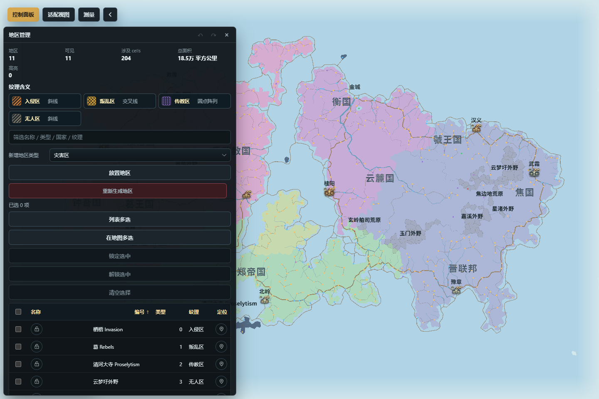

# 地区、标注与测量

地区用于表达事件或自然语义，标记用于放置资源点和通用对象，标签控制地图文字，备注保存说明，测量对象保存距离或面积结果，名称库为后续生成提供词源。它们都能出现在地图上，但数据职责不同，不应互相替代。

*图：地区管理面板显示纹理图例、地区统计、筛选和对象列表；画布按地区范围与名称呈现。*

## 地区管理

入口：“控制面板 → 管理 → 标注对象 → 地区管理”。列表显示地区名称、编号、类型、纹理、规模和涉及国家，可筛选、定位、高亮、删除和设置重生成锁。“放置地区”开启画布模式，按所选类型在地图上建立范围；完成后应退出模式。

地区可用于战区、入侵、叛乱、传教、灾害等事件语义，也可表示沙漠、沼泽、密林、草原、苔原、高地、荒地、火山地带、无人区等自然语义，还可以建立完全自定义类型。事件地区可保存结构化参与方、摘要和状态；自然 / 自定义地区则承担稳定的地理或创作分区。

“地区属性”可编辑名称、说明和四项中性基础影响：适居度修正、移动成本倍率、经济产出倍率与防御修正。自定义地区还可编辑自定义类型并选择覆盖方式；内置类别的覆盖方式由类别契约决定。“底区”表示基础分区，“覆盖区”允许叠加在其它底区之上。影响值是地区语义数据，不会悄悄直接改写 cell 高度、人口或路线；消费这些影响的系统会按各自规则读取。

“调整样式”可选择斜线、交叉线或圆点阵列，并设置颜色。样式只改变表现，不会改变类别、参与方或基础影响。地区名称由独立“地区名称”图层控制，隐藏填充不一定同时隐藏名称。

自动无人区会按中立、低人口陆地的共享边连通分量生成独立对象；显式“重新生成地区”才会更新相应自动结果。已锁定地区会按锁规则受到保护。手工地区、事件地区和自然地区应在重生成后逐项核对，尤其要避免把不相连的区域误当成一个对象。

图层中的“全部地区”是多个既有地区状态的三态批量控制，不是第六种独立地区图层：半选时点击会全开，全开时点击会全关。关闭图层不会删除地区，也不会撤销属性修改。

## 资源点与通用标记

入口：“控制面板 → 管理 → 标注对象 → 资源点与通用标记”。范围筛选可选择全部、资源点或通用标记；对象详情显示类别、资源类型、经济潜力、所属国家 / 省份和当前图形。

“放置通用标记”在下一次地图点击处创建对象，可选择自然、水文、资源、设施、商旅、危险、文化、活动或异象等类别。选中后可以移动、删除、重命名、调整图标 / 配色和编辑备注。移动模式启用时，删除会被禁用，完成拖动后应退出编辑模式。

资源点是经济系统可读取的对象，通用标记主要承担说明与视觉语义；给普通标记换成资源图标不会让它自动产生资源。自动标记按类型选择正式图形，手工图标和配色会形成显式覆盖；只有恢复自动视觉后才重新跟随类型。

资源重生成可能替换未锁定的自动资源点，手工通用标记不应被当作重生成种子。编辑结果进入地图历史；高亮只是临时辅助显示。

## 标签管理

入口：“控制面板 → 管理 → 标注对象 → 标签管理”。当前语义标签分为国家、省份、首都、城市、手工和地区六类。列表显示名称、类型、归属、状态和优先级，可新增、删除 / 恢复、定位、高亮、重命名、编辑备注与调整显示布局。

“显示布局”可设置优先级和位置锁。自动位置会随当前地图与碰撞布局求解；锁定位置后保留明确的世界坐标锚点。优先级只提高碰撞与细节层级预算中的排序机会，不保证在所有缩放级别、视口和拥挤场景中始终显示。隐藏 / 删除标签不会删除其国家、城市或地区对象；恢复标签也不会恢复已删除的目标对象。

先确定语义类型和目标对象，再改文字与位置。若只是想改变同类标签的字体、字号、字重、颜色或透明度，应到“控制面板 → 样式”编辑对应标签样式，不要逐个移动标签模拟样式差异。

## 备注总览

入口：“控制面板 → 管理 → 标注对象 → 备注总览”。备注既可以附着到国家、城市、河流等对象，也可以作为地图上的独立备注放置。表格按类型、名称、摘要、字数和更新时间筛选，可定位、高亮、重命名和编辑正文。

删除目标对象后，其附着备注可能成为“孤儿备注”。面板可以只选孤儿备注并批量清理；清理前先确认这些备注没有仍需迁移的创作内容。独立备注有自己的地图位置，不依赖其它对象。

JSON 导入先显示可导入、无效、重复 id、孤儿和同 id 冲突数量。“追加并更新同 id”保留未涉及的现有备注；“替换全部备注”会用导入集整体替换，影响更大。导出当前可见或选中备注只得到备注摘要，不是完整地图备份。

备注写入随地图保存；筛选、高亮和当前选择属于界面状态。对象备注与标签文字也不是同一字段，修改正文不会改变地图标签。

## 测量对象

入口可用地图工具栏“测量”，也可从“控制面板 → 管理 → 标注对象 → 测量对象”点击“开始测量”。测量完成后会成为地图中的可保存对象，列表显示名称、类型、模式、点数、长度、面积和更新时间。

测量工具支持按当前模式记录折线或闭合范围，并在需要时使用路线拟合。创建时按界面提示添加控制点并完成；未完成前取消不会生成对象。选中已有测量后可重命名、编辑形状、拖动控制点、删除、高亮或导出。路线拟合会按路线条件解释控制点，不等同于原始直线距离。

测量值使用“单位”页的当前显示设置进行格式化；改变显示单位不会重写地图几何。关闭测量图层只隐藏线面和控制点，保存的测量对象仍存在。导出测量适合交换测量结果，完整地图仍应另存 `.webfmg`。

## 名称库

入口：“控制面板 → 管理 → 系统工具 → 名称库”。名称库按分类、来源、名称、类型、样本数、重复样本、长度范围和绑定用途展示。可设置国家根名、地名、水文、文化与宗教等全局绑定，也可为单个文化选择名称库。

内置库不可直接破坏性改写；需要定制时先复制为用户库。用户库可以新建、删除或清空，并可从 JSON 或原版文本导入。导入前会预览有效库、样本数、重复和问题；“追加到用户库”与“替换用户库”的结果不同。名称库可导出为 JSON 或原版文本。

绑定决定后续生成及显式“按名称库重命名”的来源，不会静默重写地图上已有国家、省份、城市、文化或宗教。删除仍被绑定的用户库前，应先调整相关绑定，避免回退到无效引用或默认库。

## 对象详情与典型流程

点击地图上的可识别对象会打开对象详情，显示该对象的玩家可读字段，并提供定位或支持的编辑入口。对象详情适合确认“点到了什么”，完整批量操作仍应回到对应管理面板。开发模式才显示的内部 id、cell 和诊断字段不是普通创作流程所需信息。

一套稳妥流程是：

1. 先建立自然、事件或自定义地区，设置底区 / 覆盖区和基础影响。
2. 放置资源点与通用标记，区分自动视觉和手工覆盖。
3. 调整国家、省份、城市、手工与地区标签的文字、优先级和位置锁。
4. 把长说明写入备注；用标签只承载成图所需的短文本。
5. 用测量工具保存关键距离或面积，并切换单位检查显示。
6. 最后配置名称库绑定；需要改旧名称时使用显式重命名动作。
7. 检查地区、地区名称、标记、标签、备注和测量各图层，再保存并重新载入。

## 常见误解

- “全部地区是一种新图层。”它只是现有地区开关的批量三态控制。
- “关闭图层会删除对象。”图层只控制显示；删除必须在对象面板中明确执行。
- “给普通标记换资源图标就会参与经济。”对象类别和图形是不同字段。
- “标签优先级高就一定显示。”碰撞、缩放级别、预算和图层状态仍会共同决定可见性。
- “备注孤儿一定是垃圾。”孤儿只表示目标对象已缺失，删除前仍应检查正文。
- “路线拟合测量就是两点直线距离。”拟合模式按路线解释路径，结果可能显著更长。
- “绑定名称库会自动刷新旧名字。”只有后续生成或显式重命名动作才会写入现有对象。

需要了解这些编辑如何进入事务、撤销和安全预检，可继续阅读[编辑器与安全修改](编辑器与安全修改)。
