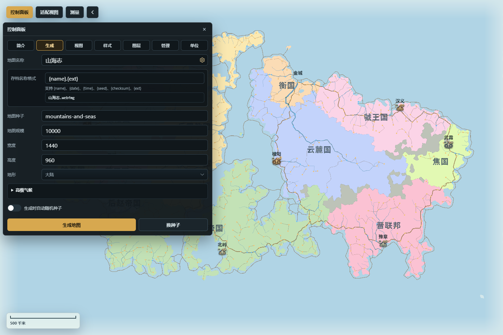

# 地图生成与项目设置

“生成”页签决定一张新地图的初始身份、规模、几何和自然条件。生成属于替换整张地图的高影响操作；开始前应先保存需要保留的当前地图。

*图：生成页集中设置地图名称、种子、规模、地形与稳定的存档文件名模板。*

## 打开生成设置

**入口**：`左上工具栏 → 控制面板 → 生成`。

地图规模、尺寸、地形模板和种子等普通生成字段只准备下一次生成；只有点击“生成地图”后，当前世界才会被新地图替换。地图名称会同步到当前项目元数据和存档预览；高级气候控件作用于已有地图时会实时重算直接气候结果，因此不能把整个页签都当成无副作用的草稿表单。

## 地图名称与存档名称格式

**用途**：地图名称用于识别当前世界，也会进入完整地图文档的项目选项和元数据。本地保存、压缩完整地图导出和云端新建共用同一存档名称格式。

**关键操作**：

- 在“地图名称”中输入便于识别的项目名。
- 点击名称右侧的设置图标，展开“存档名称格式”和实时预览。
- 模板可使用 `{name}`、`{date}`、`{time}`、`{seed}`、`{checksum}`、`{ext}`。默认格式会根据实际导出类型补入扩展名。

**结果与持久化**：地图名称随完整地图保存；存档名称格式作为浏览器偏好跨刷新保留，并供本地、压缩导出和云端新建共同读取。

**常见误区**：修改文件名模板不会重命名已经存在的本地或云端文件，也不会改变地图内容。截图、文档示例和可重复测试不宜展开含 `{date}` / `{time}` 的实时预览，以免结果随时间变化。

## 种子与随机化

**用途**：种子让同一组生成参数具有可重复的随机输入。

**关键操作**：

- 直接填写“地图种子”，再点击“生成地图”。
- 点击“换种子”会为种子字段提供一个新值；生成新世界仍以点击“生成地图”为准。
- 开启“生成时自动随机种子”后，每次生成会采用新的随机种子；需要复现实例时应关闭它并记录种子。

**结果与副作用**：相同种子只有在生成算法版本和其它选项相同时才应期待相同结果。修改种子不会重新排列当前地图；重新生成才会建立新世界。

## 地图规模与画布尺寸

**入口字段**：“地图规模”“宽度”“高度”。

- 地图规模控制目标网格单元数，界面范围为 `1,000～100,000`。规模越大，生成、派生、载入和复杂编辑所需时间与内存通常越高。
- 宽度和高度定义地图的世界画布尺寸，不等于浏览器窗口或导出 PNG 的像素倍率。
- 第一次使用建议保留默认 `10,000` 规模和 `1440 × 960` 画布；确认流程后再提高规模。

生成结果的实际单元数可能因网格构造略有差异。不要把目标规模当成对象数量，也不要用改变浏览器窗口大小代替修改世界画布尺寸。

## 地形模板

**入口字段**：“地形”。

可选模板包括大陆、地中海、高山岛屿、平原岛屿、一侧大陆、盘古大陆和群岛。模板定义初始大尺度海陆与高程倾向；河流、气候、生物群系、城市和国家等内容仍会在后续生成阶段依据地图条件建立。

模板只作用于新地图。要局部塑造当前地图，应进入“管理 → 高度编辑”；要导入外部灰度或彩色高度图，应使用高度面板中的导入工作台，而不是把图片名称填进地形模板。

## 高级气候

**入口**：生成页签中的“高级气候”折叠区。

**用途与关键操作**：

- 在自动 / 手动纬度之间切换，查看地球投影中的当前画布覆盖范围。
- 调整纬度范围、经度范围和中心纬度；比例锁可让经纬范围按当前比例联动。
- 设置赤道、北极和南极温度，控制大尺度温度梯度。
- 点击六段风带改变各纬度带的风向，并调整降水相关参数。

这些参数会成为新地图的气候输入。若在已有地图上通过气候功能应用变更，温度、降水、生物群系和适居度会重算，其它社会与世界内容可能进入待更新状态；应按气候面板提示查看并应用后续重建。

**常见误区**：风带箭头表示空气流向，不是河流方向；降水不是单一滑块的直接着色，而会受到纬度、温度、风向、水汽与地形屏障共同影响。详见[气候与降水](气候与降水)。

## 生成、影响与恢复

点击“生成地图”后，应用会用当前表单建立新地图，刷新渲染、对象索引和统计，并清理与旧地图绑定的选择、预览和编辑上下文。原地图不会自动作为一个可恢复版本保留。

建议流程：

1. 保存当前完整地图。
2. 确认地图名称、种子、规模、尺寸和模板。
3. 需要时展开并确认高级气候。
4. 生成后点击“适配视图”。
5. 先检查高度、降水、生物群系和国家专题，再开始对象编辑。
6. 保存一份新的完整地图作为生成基线。

如果只是想替换国家、省份、城市、道路、河流、资源、外交、军事或地区，不必生成整张地图；可在“管理 → 重新生成”选择目标领域，并阅读界面显示的影响范围。锁定对象会在支持的领域重新生成中受到保护。

下一步：[专题图层与视觉样式](专题图层与视觉样式)、[功能与领域总览](功能与领域总览)、[存档与导入导出](存档与导入导出)。
