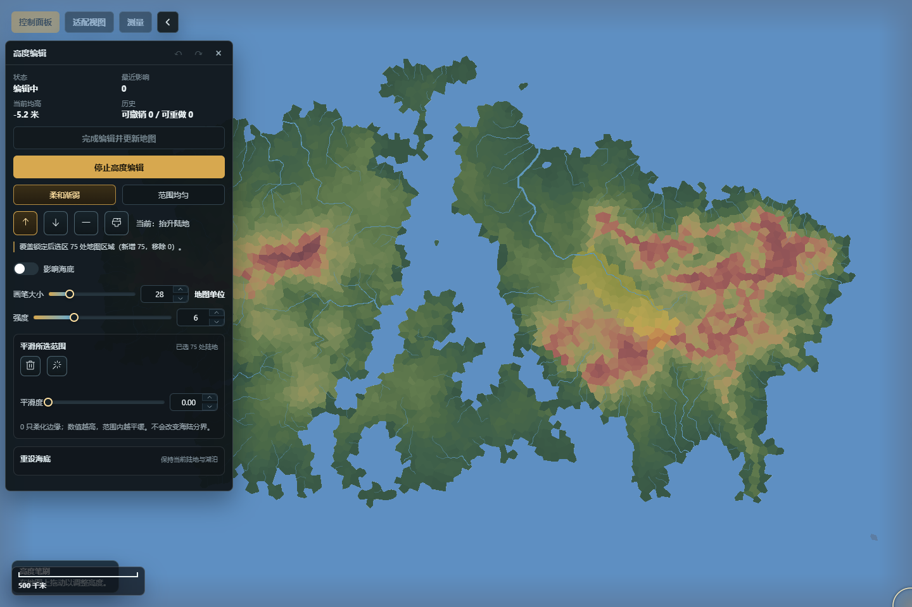

# 地形、水体与水文

这一组工具负责改变地图的物理底板：高度、陆海连通关系、河流、湖泊与洋流。入口都在“控制面板 → 管理 → 地形环境”。如果只想观察结果，可先在“视图”中切换到高度、温度、降水等模式；视图切换只改变显示，不会修改地图。

地形修改可能让河流、气候、生物群系、人口、聚落和路线等派生结果过期。稳妥顺序通常是：先改高度和海陆轮廓，再处理河湖与洋流，最后按提示重建派生系统并检查人口、聚落与路线。不要把一次成功的地形提交理解为所有下游内容已经自动重算。

*图：高度编辑已启用，地图上的黄色高亮是已涂选的平滑范围；尚未应用，所以地图数据与历史不变。*

## 高度编辑

入口：“控制面板 → 管理 → 地形环境 → 高度编辑”。它既能做局部笔刷调整，也能先建立选区，再对选区执行平滑、模板或条件变换。

### 主要工具

- 局部笔刷可选择渐弱或均匀影响，设置画笔大小和强度，并决定是否允许影响海底。适合抬高山脊、压低盆地和修整海岸附近的小范围高度。
- “涂选平滑范围”先在地图上选出范围，再调整平滑度并应用。该操作平滑选区内的高度起伏，但不会主动跨越海平面重画陆海边界。
- 常用选区可以按高度上下限、几何范围或笔刷建立，并用替换、合并、相交、相减、扩张、收缩整理。羽化会让边缘分层过渡，减少生硬台阶。
- “暂存 / 恢复选区”只用于当前编辑过程，不是浏览器偏好，也不会单独写进地图存档。
- 地形模板提供目标高度、强度、粗糙度、阶地间隔等参数；多步模板会合并为一次预览和一次历史记录。用户模板可导入、导出、保存和删除。
- 条件变换和全局平滑 / 扰动都应先生成预览，再应用。预览可取消，不会写入地图。
- 高度图导入工作台可读取本地图片，检查直方图与前后对照，设置反转、适配、映射和高度范围后再应用。颜色看起来相近并不代表导入高度一定相同，应以映射与数值预览为准。

### 推荐流程

1. 切换到“高度”视图，先确认海平面、山脊和低地位置。
2. 建立选区；需要保留周边时，先用羽化或缩小强度处理边缘。
3. 生成预览，比较选区内外的高度变化；不满意就取消或调整参数。
4. 应用后检查陆海边界、河流源头、城市和道路是否仍合理。
5. 根据面板的过期提示，依次重建必要的水文、气候、生态和聚落派生结果。

已应用的高度编辑进入地图撤销 / 重做历史；预览和未提交的选区不会。全局重建的影响远大于单次笔刷，执行前应确认锁定对象和存档状态。“重置海底”只重建海底并保留当前陆地和湖泊，不等同于重新生成整张世界。

## 水体与地貌

入口：“控制面板 → 管理 → 地形环境 → 水体与地貌”。面板按地貌单元列出陆地、海洋、湖泊等对象，可按类型、分组、采样格、面积、岸线、补给和蒸发筛选或排序，并查看港湾采样格、海岸 / 湖岸长度与异常引用。它支持定位、高亮，并可对支持的对象设置重生成锁。

海岸编辑提供开挖海岸、填海、打开 / 关闭海峡、连接湖泊与海洋等模式。操作时先在地图上框定范围，再执行预检；系统会检查陆水连通性，以及城市、河流、港口和路线等受保护对象。预检拒绝时，不应靠反复放大范围绕过，应缩小改动或先处理冲突对象。

应用成功的海岸修改是一个可撤销事务。它改变的是地形拓扑，不只是岸线画法；国家边界、聚落归属和水文结果可能需要后续复核。整湖填平与删除应在湖泊管理中完成，不要用局部海岸工具替代。

## 河流管理

入口：“控制面板 → 管理 → 地形环境 → 河流管理”。列表可按流量、长度和名称筛选或排序，详情会显示河流类型、汇入干流、流域主河、河网状态、长度、流量、汇水面积、流域平均降水、物理估算和河段数，适合查找主河、支流或异常河段。常用操作包括新增、编辑河道、删除、高亮、按名称库重命名、调整宽度系数和编辑备注；宽度系数影响成图表现，不会凭空增加流量。删除一条主河时，按钮会明确提示连同支流处理，应先检查流域关系。

“重生成河流”会按当前高度与水文条件重新求解河网。已锁定的河流会按锁规则受到保护，但锁定并不保证其周围所有高度、支流关系和下游派生字段都保持不变。手工修完一条河后，若马上全量重生成却没有锁定，它可能被替换。

典型流程是：先完成高度和湖泊出口修改，再重生成河流；随后检查河口是否落在海岸、支流连接是否合理、城市与道路是否受影响。单条属性编辑进入撤销 / 重做历史；批量删除和重生成前应先保存地图。

## 湖泊管理

入口：“控制面板 → 管理 → 地形环境 → 湖泊管理”。湖泊列表支持按面积、规模、补给、蒸发和名称筛选或排序，并显示水位、长期水量、溢流判定、蓄水指数、溢流高程、下切需求 / 预算和岸线规模。它可定位、高亮、按名称库重命名，并处理新湖开挖、湖泊出口与局部湖岸。

- 出口工具先选择与湖泊相连的出口河流，再预览并应用。它用于明确排水关系，不是简单画一条装饰线。
- 局部湖岸修补可以选择向陆地方向或水体方向调整，并设置作用半径；先在地图上选择中心，再预览、应用或取消。
- 填平并删除湖泊会改变水陆结构及相关水文结果，执行后要检查河流、聚落、路线和行政边界。

局部修补和出口变更均应在预览确认后提交，并进入历史记录。湖名、出口河流和视觉上的水面范围是不同字段；只改名称不会重算水文，只改出口也不会自动修复不合理的周围高度。

## 洋流管理

入口：“控制面板 → 管理 → 地形环境 → 洋流管理”。面板列出主要洋流并支持筛选、定位、高亮、重命名和锁定。对象属性包括所属海盆、暖流 / 寒流 / 中性性质、所属半球、环流方向、强度和西岸强化等；顶部汇总会给出主要洋流、暖流、寒流数量和当前模型。

“重算洋流”只更新洋流系统；“重算气候 / 世界”会继续影响温度、降水和后续派生系统，影响范围更大。长时间重算可取消，但取消后仍应查看面板状态，确认没有待处理的过期提示。

洋流的可见线条是结果表达，不等于气候已经同步。调整类型或强度后，先检查洋流分布，再明确执行气候重建，并到“气候统计”核对温度、降水和宜居度变化。

## 常见误解

- “高度颜色变了，河流和人口就已同步。”高度提交只保证高度事务成功；下游系统是否重建以面板状态和重建结果为准。
- “平滑选区会自动保留每条河和每座城。”平滑只处理高度；对象保护要看具体操作的预检与锁规则。
- “锁住河流就锁住了整片水系。”锁通常保护对应对象免于重生成替换，不是冻结相邻 cell、湖泊、海岸和气候。
- “洋流图层开着就代表洋流影响生效。”图层只控制显示；参数修改后仍需执行相应重算。
- “撤销可以替代存档。”撤销适合回退近期事务，跨刷新或复杂重建前仍应保存 `.webfmg` 存档。

下一步可继续阅读[气候、生态与人口](气候生态与人口)，了解地形稳定后如何重建气候、生态和人口。
