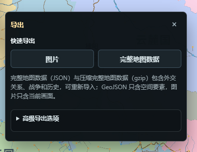

# 存档与导入导出

“保存一张还能继续编辑的地图”和“导出给图片或 GIS 工具使用的结果”是两件事。只有完整地图存档能够恢复生成参数、Grid / Pack、对象、视觉设置、标签、备注、测量、锁和派生状态；PNG 与 GeoJSON 都不是完整备份。



*图：导出浮层区分快速图片、完整地图数据和可按需展开的高级导出选项。*

## 地图名称与文件名

“生成”页的地图名称保存在生成选项和地图 metadata 中。名称不参与地图 checksum；旧图没有名称时，会用原 seed 确定性回填。

名称右侧设置入口可以编辑共享文件名模板，默认是：

```text
{name}-{date}-{time}.{ext}
```

可用 token 为 `{name}`、`{date}`、`{time}`、`{seed}`、`{checksum}` 和 `{ext}`。本地“保存”、高级压缩存档导出和云端新建使用同一浏览器偏好。未知 token 会被拒绝，非法文件名字符会清洗；云端覆盖继续使用已选远端文件的原名和身份，不会因模板变化暗中改名。

## 完整地图格式

| 形式 | 适合用途 | 能否完整恢复 |
|---|---|---:|
| `.webfmg` | 默认本地保存、压缩完整存档、云端新建 | 是 |
| 未压缩完整 JSON | 检查结构、脚本处理或兼容交换 | 是 |
| 浏览器本地存档 | 当前站点、当前浏览器的快速恢复 | 是 |
| gzip-base64 | 浏览器固定存档和模块传输的兼容外壳 | 是 |

`.webfmg` 内部仍是 `application/gzip` 的 gzip JSON，地图文档类型为 `webgl-generator-map`，当前 schema 为 v2。扩展名变化没有改变地图内容或压缩算法。旧 `.webgl-map.json.gz`、`.json.gz`、`.gz` 和 `.json` 继续可导入。

完整文档包含 typed array 的可恢复编码。导入时统一经过解析、版本迁移、兼容归一和结构校验；未来高于当前版本的文档会明确拒绝，不会猜测降级。

## 本地保存与浏览器恢复

首层“保存”会按当前模板下载 `.webfmg`。浏览器本地存档使用站点自己的固定槽位，适合刷新或下次访问继续工作，但不应当作为唯一备份：清理站点数据、换域名或换浏览器都会让它不可用。

建议在这些时点下载独立文件：

- 准备进行大范围地形、政治或重生成操作前；
- 完成一个可识别阶段后；
- 更换部署地址、浏览器或设备前；
- 需要把地图交给无头工具、脚本或其它用户时。

导入完整地图会替换当前 document identity 并清空旧编辑历史。文件选择后先阅读确认和诊断，未保存修改不会自动合并到导入地图。

## Dropbox 与 Google Drive

“控制面板 → 简介”同时提供“云端存储…”和“从云端导入…”：前者直接打开保存区，后者直接打开导入区。连接 Dropbox 或 Google Drive 后，刷新列表、选择一份地图，再点“从云端导入所选地图”；确认前不会下载，确认后会替换当前地图并清空撤销 / 重做历史，未保存修改不会与云端地图合并。导入失败时当前地图保持不变，错误会在云端面板中显示并带上远端文件名。

云端存储面板传输完整地图，不提供后台同步、自动保存、删除、分享、冲突合并或通用网盘浏览。新存档使用 `.webfmg` gzip 格式；列表中的旧 `.webgl-map.json.gz`、`.json.gz`、`.gz` 和未压缩 `.json` 继续走与本地导入相同的解析、迁移和校验链。

- Dropbox 使用 App Folder、authorization code + PKCE 和短期 access token；覆盖以远端 `rev` 为条件。
- Google Drive 只请求 `drive.file`，默认把新文件放入 `/webFMG`；只列出本应用创建并带应用标记的文件，旧根目录应用文件仍可见。
- 两者的短期 token 只保存在当前标签页 `sessionStorage`，绑定 provider、origin、配置和 scope 指纹。关闭标签页、到期、`401`、配置变化、损坏记录或主动断开都会清除。
- 刷新可以恢复仍有效的连接，但不会跨标签页共享；覆盖远端已变化的文件会拒绝并要求刷新列表。

不要把 client secret、refresh token 或用户 access token 写进 Cloud Provider Config、地图文件、截图或日志。公开部署配置只包含 OAuth client identifier、Dropbox redirect URI 和 Google Drive 文件夹路径。

## PNG 与高度灰度图

普通 PNG 导出读取当前 WebGL 画面，并按选项合成标签、城市图标、标记、军事、测量、图例和比例尺。支持 `1x～4x`、当前视口、完整地图、像素矩形和世界坐标矩形；裁剪到地图外时可保留透明背景。浮动管理面板不会进入地图 PNG。

高度灰度 PNG 是另一种数据图：它始终读取完整世界的 `grid.cells.h` 和 Grid Voronoi，把模型高度 `0～100` 线性映射为灰度 `0～255`。它不读取当前相机、主题、专题、标签或 overlay，适合外部地形处理，不代表用户当前看到的彩色地图。

## GeoJSON

| 导出 | 几何 | 主要内容 | 能否重新导入成完整地图 |
|---|---|---|---:|
| Cells GeoJSON | Pack cell `Polygon` | 高度、水陆、国家、省份、文化、宗教、生物群系、人口 | 否 |
| Feature GeoJSON | Point / LineString / MultiPolygon | 城市、路线、河流、标记、地区、国家和省份 | 否 |

两类 GeoJSON 使用地图世界范围到经纬坐标的近似等距圆柱映射，并明确标注为未注册的近似坐标参考，不伪造 EPSG。可以按全图、当前视口或 bbox 导出；政治面可选择 dissolve 为合并后的 MultiPolygon。路线和河流使用稳定字段字典，但不存在的数据（真实交通量、流速等）不会凭空补造。

## 备注、测量与专题交换

备注摘要、测量集合、名称库、视觉主题和部分领域档案可以单独导入导出。它们用于交换某一类资料，不替代完整地图存档。导入集合前可先调用统一检查入口查看文档类型、版本、条目数、冲突和需要确认的动作。

测量 JSON 保存世界坐标点、显示单位、距离 / 面积摘要和绘制选项；备注 JSON 保存对象引用、正文与孤儿状态。是否进入完整存档取决于对象是否已经保存到地图，而不是界面上是否存在一段临时草稿。

## 导入诊断

完整地图、普通 GEO、FMG Cells GEO 和高度图使用统一结构化诊断。失败报告包含来源摘要、文件类型、失败阶段、稳定 code、中文说明和建议，不包含原文件正文、坐标数组或图片像素。

遇到失败时：

1. 不要重复导入或手工删字段。
2. 导出最近一次诊断，确认是解析、版本迁移、schema、业务验证还是写入阶段。
3. 保留原文件不动，在副本上验证修复。
4. 成功后另存为新的 `.webfmg`，重新加载并检查地图名称、checksum、人口、对象和视觉设置。

旧格式的详细边界见 [旧图兼容](旧图兼容)，外部自动化读写见 [API 与自动化](API与自动化)。
