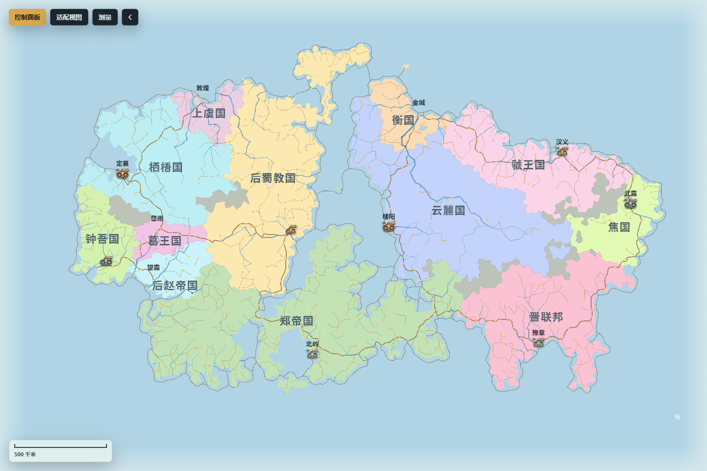

# 安装与快速开始

本页面向第一次运行项目的用户。完成后，你会得到一张可查看、可编辑并可重新载入的完整地图。

## 运行要求

- Node.js `^20.19.0` 或 `>=22.12.0`。
- pnpm 10。
- 支持 WebGL2 的现代桌面浏览器。

在仓库根目录执行：

```powershell
pnpm install
pnpm run start:app
```

按终端实际输出打开本地地址。Windows 的部分端口可能被系统排除，因此不要把历史 profiling 使用的 `5300` 或其它固定端口当成普通启动地址。

`source/Fantasy-Map-Generator` 是参考实现，不是正式应用入口，也不应被修改。正式应用位于 `app/webgl-generator`。

## 第一次使用

1. 等待加载画卷消失，确认地图和左上工具栏已经出现；把指针移到地图对象上时，悬停信息卡会按需显示。
2. 点击“控制面板”，进入“生成”页签。先保留默认地图规模和画布尺寸，只修改地图名称或种子。
3. 点击“生成地图”。生成会建立一张新的完整地图；如果当前地图已有需要保留的编辑，请先保存。
4. 点击“适配视图”，让完整地图重新进入当前窗口。
5. 在“视图”页签切换“高度”“生物群系”或“国家”等专题；在“图层”页签开关道路、河流、城市和标签。
6. 点击地图上的城市、国家、河流或其它对象，查看对象详情；再从“管理”页签打开对应领域面板。
7. 做一次小修改后使用面板标题栏的撤销、重做，确认编辑历史符合预期。
8. 回到“简介”页签，选择“保存到本地”或“保存到浏览器”。需要分享或备份时，优先保存完整地图数据，而不是只导出图片。



*图：主界面显示地图画布，以及控制面板、适配视图、测量和工具栏收起入口。*

## 入口、结果与持久化

- “控制面板”是项目、生成、视图、样式、图层、管理和单位的统一入口。打开或关闭面板不会修改地图。
- “适配视图”只调整相机，不改变地图尺寸、对象位置或导出数据。
- “测量”会进入测量绘制流程；保存后的尺、路线、曲线和面积可在“管理 → 测量对象”中继续管理。
- “保存到浏览器”适合当前浏览器中的快速恢复；本地完整地图文件更适合长期备份和跨设备传递。
- 主题、图层、单位和面板位置等界面偏好可跨刷新保留。地图本身仍应通过浏览器存档或完整地图文件保存，不能把“页面刷新后界面还在”误认为地图已经备份。

## 常见误区

- 专题和图层是同一地图的不同观察方式，不会因为切到“国家”或关闭“城市”而删除对象。
- PNG 只保存当前画面，GeoJSON 只保存所选空间要素；只有完整地图数据包含可继续编辑的完整世界状态。
- 开发模式只显示诊断工具，不决定浏览器 API 是否存在，也不是编辑权限开关。
- 若刷新后看到的图层与文档截图不同，先检查浏览器是否恢复了旧的显示偏好。

接下来阅读：[界面与基础操作](界面与基础操作)、[地图生成与项目设置](地图生成与项目设置)和[存档与导入导出](存档与导入导出)。

## 生产构建

需要验证正式构建时执行：

```powershell
pnpm run build:app
pnpm run preview:app
```

预览地址仍以终端输出为准。
