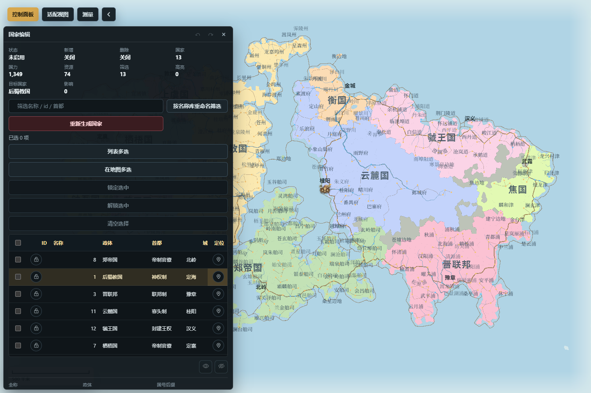
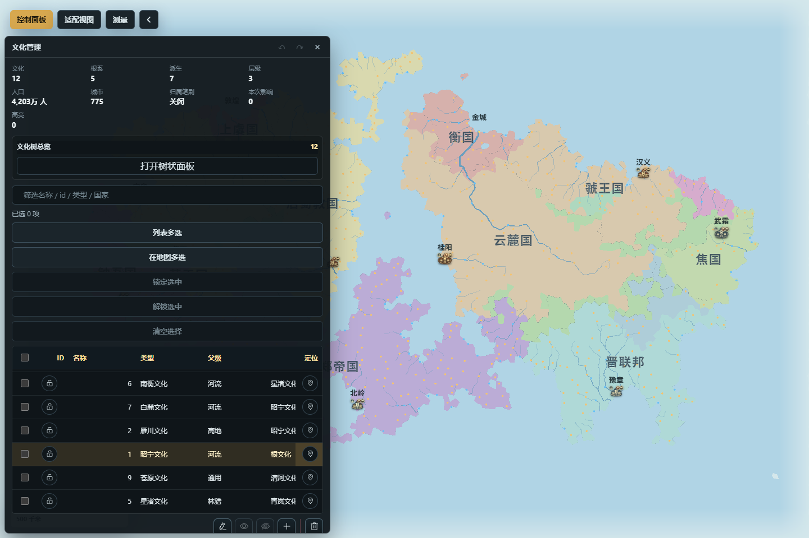

# 政治、社会与聚落

这一组面板维护国家、省份、城市、政体、文化和宗教。它们共享地图上的归属关系，却不是同一层数据：改变国家边界不会自动重写文化，改变文化中心也不会自动迁都，人口变化也不等同于行政区变化。

*图：国家编辑面板显示国家统计、筛选、锁定、定位和对象列表；画布显示国家与省份名称。*

## 国家编辑

入口：“控制面板 → 管理 → 政治社会 → 国家编辑”。表格可按国力、经济、资源、人口、城镇和面积筛选或排序，并支持选中、定位、高亮及重生成锁。

主要操作包括新增、删除和编辑国家范围，修改名称、颜色、政体与后缀、首都和备注。新增 / 删除 / 范围编辑属于画布模式：开启后应留意面板状态，操作完及时退出，避免后续点击被当成编辑输入。

国家合并只接受规则允许的相邻目标；国家拆分以完整省份为基本选择，避免把同一省份切成两个不一致的归属。两类拓扑操作都会先给出影响范围，再作为单个事务提交；任一步失败时不保留半个合并或半个拆分。

推荐流程：先筛选并高亮目标国家，检查邻接、首都、省份和城市；再打开合并或拆分工具，阅读预检结果；确认后检查国界、国家名称、首都、外交与经济汇总。属性编辑和成功的拓扑事务进入撤销 / 重做历史。锁定国家可防止相应重生成替换其身份或受保护内容，但不会冻结境内每个 cell、城市人口和所有派生统计。

## 省份管理

入口：“控制面板 → 管理 → 政治社会 → 省份管理”。列表显示所属国家、面积、cell 数、经济力、资源潜力等，可新增、删除、编辑范围、重命名、调色和编辑备注。

“重评省会”用于按当前城市与省份条件重新选择省会。先预览当前省份或全部未锁定省份，确认候选变化；应用时会再次核对预览指纹，并以一个原子事务更新。旧地图不会因为打开面板就静默重评，只有显式预览并确认才会写入。

编辑省界后应检查省份仍属于正确国家、中心与城市归属一致、国家拆分条件没有被破坏。批量按名称库重命名只作用于当前筛选结果；名称库绑定不会自动重命名现有省份。重生成锁保护省份对象免于相应重生成，不代表其中的城市、文化或资源不可编辑。

## 城市管理

入口：“控制面板 → 管理 → 政治社会 → 城市管理”。表格可按人口、资源、类型、国家和省份检索。新增城市是在下一次地图点击处创建；删除模式等待点击目标城市；移动模式则拖动当前选中城市。三种画布模式互斥，完成后应退出。

对象动作包括重命名、调整人口、同步归属到所在 cell、编辑备注，以及选择城市剪影和文化配色。自动视觉根据人口规模、城市角色与文化样式组合；手工选择剪影或配色后会形成显式视觉覆盖，“恢复自动”才会重新跟随自动规则。首都、省会等角色是城市属性上的叠加，不应通过选择“大城市图标”来伪造。

移动或改归属后，检查城市没有落水，国家 / 省份与所在 cell 一致，标签和路线仍位于合理位置。人口写入会刷新城市规模及相关汇总，但不会自动改变国家边界。成功操作进入历史；重生成城市可能替换未锁定对象或自动视觉，重要城市应先锁定并保存。

## 政体管理

入口：“控制面板 → 管理 → 政治社会 → 政体管理”。面板按政体和家族汇总国家数、人口、经济、军力与代表国家，可按政体家族筛选；选择一个政体后，还能查看时代、国力、资源、贸易修正和外交概况。

可以选中当前分组中的国家，批量应用新的政体，并把当前结果导出为 CSV 或 JSON。批量操作前先确认“已选国家”数量和筛选范围，避免把“当前可见”误当成“只改当前一国”。政体会影响展示名称和部分派生效果，但不会自动改写外交关系或触发战争。

政体变更进入撤销 / 重做历史。导出只是报告，不会创建地图存档；需要保留可继续编辑的完整状态时仍应保存 `.webfmg`。

*图：文化管理面板显示文化统计、继承树入口、筛选、锁定、定位和对象列表；画布按文化着色。*

## 文化管理

入口：“控制面板 → 管理 → 政治社会 → 文化管理”。面板同时提供继承树和对象列表，显示类型、父级、层级、覆盖 cell、人口、城市和主要国家。可以新增空文化、删除并清除归属、在地图上编辑归属，或修改名称、颜色、父级、中心、扩张强度、名称库绑定和备注。

“中心与扩张”有保存参数和重新扩张两种不同意图。只保存适合记录新中心或参数而不改当前边界；重新扩张会根据当前地形、中心和强度重新计算未受保护的文化归属。先查看预览和影响数量，再确认执行。若选择联动宗教，应明确开启；默认不要假设文化变化会自动重算宗教。

归属笔刷适合局部例外，重新扩张适合整体重算。常见顺序是先自动扩张，再用笔刷修边，最后调整继承与命名。删除文化会清除其归属，不等于把所有 cell 自动分给最近文化；完成后应检查无文化区域、人口汇总和国家交错情况。

## 宗教管理

入口：“控制面板 → 管理 → 政治社会 → 宗教管理”。面板显示宗教类型、形态、父级、层级、覆盖范围、人口、文化和国家，可新增空宗教、删除并清除归属、使用归属笔刷，并编辑名称、颜色、继承、中心、扩张范围 / 强度和备注。

民间信仰遵循文化范围约束，扩张强度也有相应限制；不要把它当成可任意跨文化传播的普通组织宗教。调整父级时系统会防止非法继承环。中心与扩张同样区分“只保存参数”和“重新扩张”：前者不重画边界，后者才会产生覆盖变化，并应先预览再确认。

宗教名称、主神、形态和地图归属是不同字段。只重命名不会改变覆盖；只换父级也不会自动重算中心。成功写入进入历史，重生成锁只保护契约内的宗教对象，不会冻结文化、人口或国家。

## 一套稳妥的建国与社会编辑流程

1. 先稳定地形、人口和主要城市，保存一份基线。
2. 编辑国家范围与首都，再编辑省份并显式重评省会。
3. 调整城市位置、归属、人口和视觉，检查落水与归属一致性。
4. 设置政体；外交和军事变化到各自面板单独处理。
5. 先自动重建文化 / 宗教，再做少量归属笔刷和继承修订。
6. 用国家、文化、宗教和人口视图交叉检查；执行一次撤销 / 重做抽查后保存并重新载入。

## 常见误解

- “国家、文化和宗教边界应该永远重合。”三者是独立语义层，交错分布是允许的。
- “改首都图标就是迁都。”首都角色必须通过国家 / 城市的正式字段修改，图标或剪影只是表现。
- “名称库绑定会立刻改掉所有旧名字。”绑定影响后续生成或显式批量重命名，现有对象不会静默改名。
- “保存扩张参数等于已经重新扩张。”只有明确选择重新扩张并确认预览，地图归属才会改变。
- “锁定国家就能保护其中全部省份和城市。”各类锁有自己的对象分母和保护边界，应分别确认。
- “旧地图打开后会自动选出新省会。”旧图重评要求显式预览和确认，不会静默改写。

路线、经济、外交和军事的后续联动见[路线、经济、外交与军事](路线经济外交与军事)。
