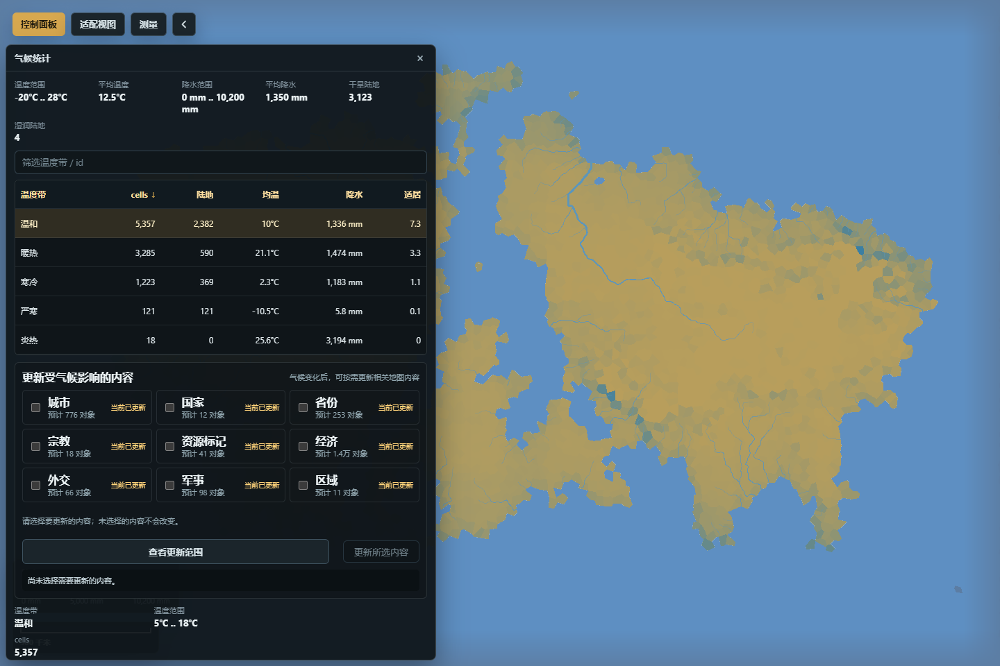

# 气候、生态与人口

气候决定温度和降水分布，生态把气候与地形转换为生物群系和数值适居度，人口再分布到乡村 cell 与城市。这三层相互关联，但不是一个开关：修改上游后，必须明确检查并更新需要的下游系统。

*图：气候统计面板保留标题与全局工具栏，同时显示温度带摘要和“更新受气候影响的内容”范围。*

## 气候参数与气候视图

全局气候参数位于“控制面板 → 生成 → 高级气候”。可以设置赤道、北极和南极温度，纬度 / 经度范围、画布纬度、大气风带与降水倍率。自动纬度会结合地图条件选取位置；切换为手动纬度后，画布纬度才由用户直接控制。

“控制面板 → 视图”中的“温度”和“降水”只改变主画布的着色。它们适合比较高纬、低纬、迎风坡、背风坡、沿海和内陆差异，但不会重新计算气候。降水也不是一层独立随机颜色：纬度、温度、风带、海陆分布和地形屏障都会参与结果。

调整全局参数前，先记下当前温度范围、平均降水和目标区域的对照区。一次只调整少量参数，再观察全图与局部变化；若所有地区一起变湿，不能把它解释为某个局部雨影问题已经解决。

## 气候统计

入口：“控制面板 → 管理 → 地形环境 → 气候统计”。面板按温度带汇总 cell 数、陆地 cell 数、平均温度、平均降水、干湿分布和平均适居度，并显示全图的温度 / 降水范围、地图纬度与大气配置。它是检查结果和启动下游重建的地方，不直接充当局部气候画笔。

气候变化后，“更新受气候影响的内容”会列出城市、国家、省份、宗教、资源标记、经济、外交、军事和地区等候选系统，以及预计影响对象数、依赖关系和当前是否过期。先点“查看更新范围”，确认必需依赖与预计数量；再勾选需要更新的内容并执行。系统按安全依赖顺序统一刷新，失败时回滚，不应手动用错误顺序逐项拼接结果。固定 seed 只在开发诊断模式出现，普通使用不需要设置。

典型流程：

1. 在温度和降水视图中确认问题不是单纯的显示误读。
2. 修改高级气候参数，再回到气候统计比较各温度带与全图指标。
3. 查看下游更新范围；保留系统自动标出的必需依赖。
4. 更新所选内容，等待统一刷新完成。
5. 到生物群系、人口、城市和路线面板复核实际结果，并保存地图。

气候参数提交与下游重建是不同步骤。关闭面板不会自动更新；面板显示“当前已更新”才说明相应派生系统与当前气候一致。

## 生物群系与数值适居度

入口：“控制面板 → 管理 → 地形环境 → 生物群系”。列表按生物群系显示 cell、面积、人口、平均适居度、城市数和基准宜居值，可筛选并查看详情。

“生物群系归属笔刷”先选择目标群系、作用范围和画笔大小，再在地图上涂绘。作用范围可限制在陆地或水域等允许区域，避免把陆地群系误刷到水体。“数值适居度笔刷”可选择“直接设值”或“恢复自动基准”，并限定在陆地、水域或全部范围。提交前留意面板报告的气候或高度异常 cell；水域人口承载始终为零。

生物群系名称、基准宜居值与某个 cell 的数值适居度不是同一概念。手工改群系不会自动搬迁人口；手工改适居度也不会立即生成或删除城市。应用后的笔刷事务可撤销 / 重做，但后续若执行全量生态重建，未受保护的手工结果可能被重新计算。

适合的操作顺序是：先稳定高度和气候，再用自动重建得到基础生态，最后只对少量特殊地区使用笔刷修订。完成后切换“生物群系”视图，检查边界、异常 cell 和人口分布是否合理。

## 人口统计与人口事务

入口：“控制面板 → 管理 → 政治社会 → 人口统计”。表格按范围汇总人口，显示名称、所属、总人口、乡村人口、城市人口、密度和城镇数。它既可用来比较国家、行政区等同类范围，也提供“区域人口增减”和“区域人口转移”两个安全写入入口。

### 区域人口增减

选择一行，输入增减量后先点“预检”。只有预检有效时才能“应用单次调整”。结果会报告调整前后人口，以及受影响的地图 cell 和城市数量。减少量超过可用人口、目标为空或被规则拒绝时，不会产生部分写入。

### 区域人口转移

选择来源后，只能从面板提供的同类型目标中选择去向。输入转移人口，先预检，再确认转移。系统在一个事务内同时减少来源、增加目标，并更新对应的乡村 / 城市人口与聚合结果；中途失败会整体回滚。

人口事务进入撤销 / 重做历史，并会刷新城市规模与相关统计。它不会自行修改气候、地形或行政边界。显示单位可能经过格式化，判断是否精确写入应看预检和结果报告，不要按表格中的缩写数字倒推底层值。

## 一套稳妥的联动流程

1. 完成高度、海岸和水文修改。
2. 调整气候参数，用温度 / 降水视图和气候统计确认方向。
3. 查看并执行气候下游重建。
4. 在生物群系面板处理少量人工例外，复核数值适居度。
5. 最后执行人口增减或同类区域转移，检查城市规模、行政汇总和地图表现。
6. 撤销 / 重做一次关键事务进行抽查，再保存并重新载入验证。

## 常见误解

- “降水是可以单独涂色的图层。”降水视图是计算结果的显示；全局气候来自纬度、风带、海陆和地形的共同作用。
- “平均适居度就是人口密度。”适居度是承载条件之一，人口还受城市、行政范围和既有分配影响。
- “重建生物群系会保留所有人工生态笔刷。”全量重建可能覆盖未受契约保护的派生值；人工修订应放在自动重建之后。
- “人口转移可以跨任意两行。”面板只允许规则认可的同类型范围，预检会阻止不合法目标和部分写入。
- “保留人口就意味着所有下游都不会过期。”保留人口只约束人口相关写入，不会自动清除其它派生系统的过期状态。
- “锁定一个对象等于冻结所在区域。”重生成锁保护的是契约列出的对象身份或字段，不是整片 cell、气候和人口的通用冻结。

政治边界、城市与文化的编辑方式见[政治、社会与聚落](政治社会与聚落)。
