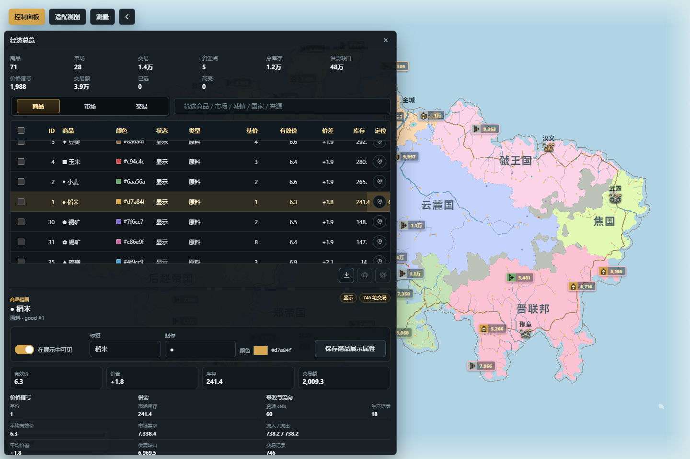

# 路线、经济、外交与军事

路线决定可用的交通网络，经济在资源、市场与路线之上计算供需和交易，外交记录国家间关系，军事则维护军团、驻地和战报。四者会互相提供条件或指标，但写入边界彼此独立：改成敌对关系不会自动开战，画一条道路也不会立刻生成新的贸易，记录战报也不等于完整战争模拟。

*图：经济总览面板打开“商品”范围，显示商品、市场、交易摘要与商品列表；画布同时显示道路和军事标记。*

## 路线管理

入口：“控制面板 → 管理 → 网络经济 → 路线管理”。表格显示路线类型、起点、终点、长度、段数和经过的资源 cell，可筛选、排序、定位、批量选择、高亮和设置重生成锁。

“绘制路线”开启画布模式；按界面提示指定起终点及必要的途经点后提交。路线类型包括道路、小径和海路，等级包括主要、次要、支线和小径。编辑已有路线时可修改类型、等级、城市端点和途经点，并先生成预览；取消预览不会写入地图。

路线求解会根据地形、水陆、可通行条件和路径成本寻找连线，并非在两点间无条件画直线。无法找到合法路径时应调整端点、途经点或地形，而不是把失败当成已生成但不可见。

可以删除当前路线或批量删除选中路线，也可以“重算道路”。成功的绘制、编辑和删除进入撤销 / 重做历史；重算会影响未锁定路线，手工路线应先锁定。路线备注只记录说明，不参与寻路或贸易计算。

推荐流程：先完成城市与海岸，再生成基础路线；用高亮检查跨海、绕山和端点；修正少量重要路线并锁定；最后到经济面板重算经济链。

## 经济总览

入口：“控制面板 → 管理 → 网络经济 → 经济总览”。面板分为“商品”“市场”“交易”三个范围：

- 商品表显示基价、有效价、价差、库存、缺口、交易数和交易额。可修改商品是否显示、标签、图标和颜色；这些是展示属性，不会改变商品产量或价格公式。
- 市场表显示所属国家、中心城市、覆盖 cell、跨国覆盖、库存、缺口和交易额。可修改市场名称与颜色，并对市场对象设置重生成锁。
- 交易表显示商品、卖方、买方、路线类型、距离、运费、数量和金额。结构化查询可以按国家、行政区域、市场、商品、卖方和买方组合过滤，并可定位关联对象。

### 编辑市场归属

在“市场”范围选择目标市场和画笔大小，开启“编辑市场归属”，再在地图上涂选。预览会报告待修改 cell 数、跨国覆盖、无国家覆盖、水域或无效市场等警告；存在无效覆盖时不能应用。确认后使用“应用并重算”，把归属变化与经济链刷新作为一个受控流程提交；取消预览不写入。

若只需根据当前地图重新计算供需与交易，可退出归属笔刷后点击“重算经济链”。重算会使用当前资源、人口、市场和路线，不会替你修复错误路线或行政归属。市场和交易流有各自的重生成锁；锁住市场不等于锁住所有交易，锁住交易流也不冻结商品展示属性。

CSV / JSON 导出用于分析当前表格或选中行，不是完整地图备份。经济数值可能因路线、人口、政体和资源重算而变化，手工核对时应同时记录输入状态。

## 外交管理

入口：“控制面板 → 管理 → 政治社会 → 外交管理”。先选择主体国家，矩阵和列表会显示其它国家与它的关系、贸易、国力、邻接、文化和宗教。可按当前关系、主体国家或全部历史查看外交纪事，并高亮所选关系。

“调整关系”选择新关系即提交，写入外交矩阵和历史，同时把填写的说明保存为纪事原因；该事务可撤销。面板明确只记录外交状态，不会自动创建军团、推进战线或结算损失。若关系变化应带来军事行动，需要到军事面板另行处理。

“重新生成外交”会按当前世界条件重算未锁定关系，影响范围较大；执行前应锁定需要保留的关系并保存。导出的外交 CSV / JSON 是报告；重新导入完整地图仍应使用地图存档。

典型流程是：选主体国家，检查邻接和贸易证据；修改一条关系并填写简短原因；到历史中确认记录；再根据需要更新军事态势。不要仅凭关系颜色判断贸易方向，详情中的交易额、数量和净流向才是经济证据。

## 军事管理

入口：“控制面板 → 管理 → 网络经济 → 军事管理”。可按国家和态势筛选军团，查看兵力、主兵种、驻扎适宜度、移动速度、驻地、基地、文明条件、外交压力、资源压力和所属战报链。

常用操作包括重命名、修改单个军团态势、把态势应用到当前筛选结果、设置驻地 / 基地，以及调整兵种比例。批量态势会作用于筛选结果，执行前应核对可见行数。驻地与基地必须从面板认可的目标中选择；适宜度是位置条件的综合评分，不等于部队一定获胜。

“重新生成军事”会重建未锁定军团。重要手工编制、驻地或身份应先设置锁，并在重算后核对兵力、兵种和战报关联。属性编辑与轻量结算进入历史；导出的军事统计或战报文件不等于完整地图存档。

### 高级战报档案与轻量结算

展开高级区后，可按战报链、战斗类型、结果和结算状态筛选记录，导入 / 导出战报档案，并清理当前范围内的记录。新记录可只保存战报，也可选择“记录并结算”；后者会在预览确认后应用轻量兵力损耗和状态结果。

轻量结算的职责是把一次有限结果写回当前军团，并维护可追溯的战报链。它不是回合制战争引擎，不会自动移动所有部队、重画国界、修改外交或推演整场战争。清理战报只应针对面板明确显示的范围；清理前先导出档案或保存地图。

## 一套稳妥的联动流程

1. 稳定城市、海岸与资源点，生成或修订路线并锁定手工主干线。
2. 在经济面板重算经济链，检查市场跨国覆盖、缺口与异常远距交易。
3. 选择主体国家调整外交关系，填写原因并确认历史记录。
4. 在军事面板设置军团态势、驻地、基地和兵种比例。
5. 需要叙事记录时先写战报；确需改变兵力时才启用轻量结算并检查预览。
6. 分别核对路线、经济、外交和军事结果，撤销 / 重做抽查后保存。

## 常见误解

- “路线就是两点之间的直线。”路线必须满足寻路条件；失败不会用穿山或跨海直线兜底。
- “画好道路，交易会实时自己出现。”路线是经济输入之一，完成后仍要明确重算经济链。
- “市场归属画笔可以覆盖任意水域或外国领土。”预览会报告水域、无效目标和跨国覆盖，非法范围不能应用。
- “外交改成敌对就会自动打仗。”外交面板只写关系和历史，军事行动需单独执行。
- “战报等于战斗模拟。”战报可仅作档案；轻量结算也只处理有限结果，不接管完整战争流程。
- “一个锁能保护整条联动链。”路线、市场、交易流、外交和军事各有独立锁边界，应逐类确认。

地区、资源标记、地图文字和测量工具见[地区、标注与测量](地区标注与测量)。
